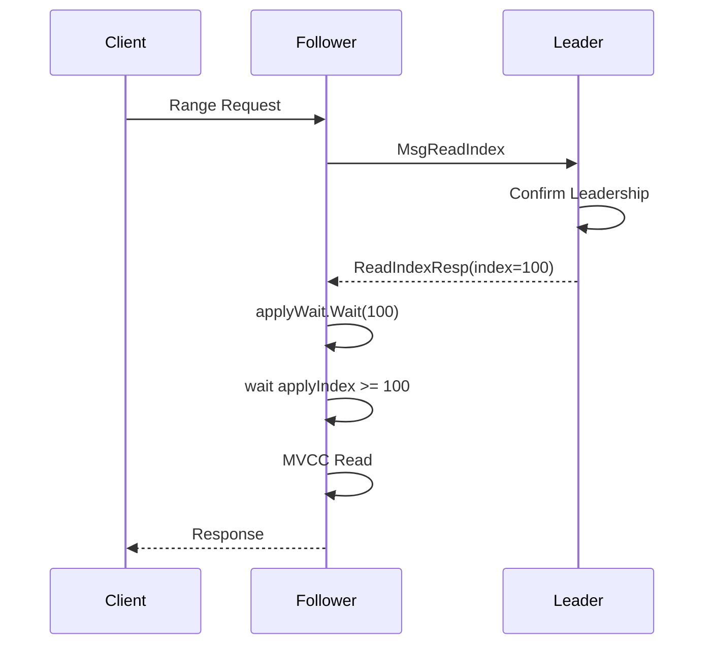

+++
title = 'Leader 不参与读请求？etcd 线性读实现揭秘'
date = 2026-06-22T15:57:38+08:00
categories = ["etcd", "raft"]
tags = ["etcd", "raft", "linearizable-read", "serializable-read"]
author = 'xhy'
+++

在很多分布式系统中，读请求通常都会转发给 Leader。

原因很简单：只有 Leader 才知道哪些日志已经提交（committed），哪些数据是最新的。

但 etcd 允许 Follower 节点直接处理线性一致读（Linearizable Read）。

这不禁让人产生几个疑问：
- Follower 如何知道自己读到的是最新数据？
- Leader 如何向 Follower 证明某个状态已经提交？
- 为什么 ReadIndex 不需要写日志，却依然能够保证线性一致性？

本文将结合 etcd 源码，分析线性一致性读的完整实现。

## 线性读和可串行化读区别

在介绍源码前先讲下线性读和可串行化读的区别。

线性读满足 CAP 理论中 C 的读模式，意味着只要写“成功”（commited）的数据，线性读一定可以读到该数据，否则将不可用，它满足 CAP 理论的 CP 模式。

可串行化读不会与 Leader 进行额外交互，因此可能读到落后的数据。
它牺牲了一致性要求，换取更低的延迟和更高的可用性。

leader/follower 节点可自然的提供可串行化读服务，它们的处理逻辑是一样的，都是根据请求从本地存储引擎读数据。

而线性读因为是“最新”的数据，当 follower 接收到线性读请求时可以把请求转发给 leader 处理（因为 leader 知道哪些是“最新”的），这也是很自然的。
但是线性读请求太多（etcd 用线性读还是很普遍的，比如 kubernetes）会造成 leader 节点负载过大（leader 只有一个）严重的话可能会造成服务不可用。

etcd 解决这种问题的方案是 follower 节点也可以处理线性读请求。follower 节点通过和 leader 节点交互获取“最新”数据，然后在本地存储引擎读取最新数据。这种方式大大减轻了 leader 节点的压力。笔者觉得这是非常巧妙的解决方案。

``` go
func (s *EtcdServer) Range(ctx context.Context, r *pb.RangeRequest) (*pb.RangeResponse, error) {  
    ...
  
	// 1. 判断是否开始线性读
    if !r.Serializable {  
       // 2. 进入线性读处理逻辑
       err = s.linearizableReadNotify(ctx)  
       ...
       if err != nil {  
          return nil, err  
       }  
    }  
    ... 
  
    // 3. get 用于读存储引擎中的数据
    get := func() { resp, _, err = txn.Range(ctx, s.Logger(), s.KV(), r) }  
    // 4. 可串行化读流程，会回调 get 获取数据
    if serr := s.doSerialize(ctx, chk, get); serr != nil {  
       err = serr  
       return nil, err  
    } 
    // 5. 返回 resp 数据 
    return resp, err  
}
```

整个读请求流程由 `EtcdServer.Range` 处理，注意 leader 或 follower 都可以处理该请求。

线性读和可串行化读的区别在于是否进入 2 线性读处理逻辑。这里 2 是核心，我们在进入 2 之前先把可串行化读逻辑看一遍，毕竟这部分是共用的。

## 可串行化读

可串行化读主要由 3 和 4 处理，3 是一个闭包函数，通过 4 回调。我们看下 4 在干嘛：

```go
func (s *EtcdServer) doSerialize(ctx context.Context, chk func(*auth.AuthInfo) error, get func()) error {  
    // 处理认证鉴权
    ai, err := s.AuthInfoFromCtx(ctx)  
    if err != nil {  
       return err  
    }  
     
    ...
    // 回调 get 函数 
    get()  
    ... 
    return nil  
}
```

不难理解，如果请求通过认证鉴权就会进入 get 函数处理该读请求：
```go
func Range(ctx context.Context, lg *zap.Logger, kv mvcc.KV, r *pb.RangeRequest) (resp *pb.RangeResponse, trace *traceutil.Trace, err error) {  
    ...
    // 调用 mvcc kv.Read 获取读事务
    txnRead := kv.Read(mvcc.SharedBufReadTxMode, trace)  
    defer txnRead.End()  
    // executeRange 处理读请求
    resp, err = executeRange(ctx, lg, txnRead, r)  
    return resp, trace, err  
}

func executeRange(ctx context.Context, lg *zap.Logger, txnRead mvcc.TxnRead, r *pb.RangeRequest) (*pb.RangeResponse, error) {  
    ...
    // 根据请求组装 mvcc.RangeOptions 结构
    ro := mvcc.RangeOptions{  
       Limit: limit,  
       Rev:   r.Revision,  
       Count: r.CountOnly,  
    }
    
    // 读事务读请求的数据
    rr, err := txnRead.Range(ctx, r.Key, mkGteRange(r.RangeEnd), ro)  
	if err != nil {  
	    return nil, err  
	}
	
	// 对请求数据 rr 进行处理得到 resp 并返回
	return resp, nil
}
```

核心工作流程是通过读事务的 `Range` 方法获取存储引擎中的数据。

这是可串行化读的流程，我们从之前的分析可知，线性读需要和 leader 节点交互获取“最新”数据，然后等本地更新最新数据之后才能走可串行化读流程，这部分就是在 `linearizableReadNotify` 做的。

## 线性读

是时候看看期待已久的 `linearizableReadNotify` 在做什么了。

```go
func (s *EtcdServer) linearizableReadNotify(ctx context.Context) error {  
    s.readMu.RLock()  
    nc := s.readNotifier  
    s.readMu.RUnlock()  
  
    // signal linearizable loop for current notify if it hasn't been already  
    select {  
    case s.readwaitc <- struct{}{}:  
    default:  
    }  
  
    // wait for read state notification  
    select {  
    case <-nc.c:  
       return nc.err  
    case <-ctx.Done():  
       return ctx.Err()  
    case <-s.done:  
       return errors.ErrStopped  
    }  
}
```

方法并不复杂，不过逻辑很有意思。首先理清它的流程才能知道这个方法到底在干嘛。

方法先把 `s.readNotifier` 赋给变量 nc，注意这里用的是读锁，意味着读请求都将获得 `s.readNotifier`。
接着进入 select，它将 `struct{}{}` 发给 `s.readwaitc` 通道，该通道是一个有缓冲，容量为 1 的通道：
```go
s.readwaitc = make(chan struct{}, 1)
```

这个 select 是在做什么呢？我们想象下，第一个请求进来往 `s.readwaitc` 发通知，如果 `s.readwaitc` 还在处理请求，那么同时来的其它请求会进入 `select:default` 分支。
最后请求都会阻塞在 `nc.c` 等待处理结果。

大致知道发送端的流程，我们看消费端是怎么消费 `s.readwaitc` 的：
```go
func (s *EtcdServer) linearizableReadLoop() {  
    for {  
       // 生成下一个请求的 id
       requestID := s.reqIDGen.Next()  
       select {  
       ... 
       // 阻塞在 readwaitc 通道
       case <-s.readwaitc:
       ...
       }
       
       // 生成下一个 notifier
       nextnr := newNotifier()
       // 加写锁  
	   s.readMu.Lock()  
	   // 将 s.readNotifier 赋值给变量 nr
	   nr := s.readNotifier  
	   // 将下一个 notifier 赋值给 s.readNotifier
	   s.readNotifier = nextnr  
	   s.readMu.Unlock()
	   
	   confirmedIndex, err := s.requestCurrentIndex(leaderChangedNotifier, requestID)  
	   if isStopped(err) {  
		   return  
	   }  
	   if err != nil {  
		   nr.notify(err)  
		   continue  
	   }
	   
	   // 获取本节点应用索引
	   appliedIndex := s.getAppliedIndex()  
       // 如果本节点应用索引小于 confirmed 索引，说明请求的数据还没应用到本节点
       // 需要继续等
       if appliedIndex < confirmedIndex {  
          select {  
          case <-s.applyWait.Wait(confirmedIndex):  
          case <-s.stopping:  
             return  
          }  
       }  
       // 如果本节点应用索引大于等于 confirmed 索引，说明请求的数据已应用到本节点
       // 直接返回即可  
       nr.notify(nil)  
       ...
    }  
}
```

可以把 readwaitc 理解为一个“批处理触发器”。

第一个到达的读请求负责通知后台协程执行一次 ReadIndex。后续同时到达的读请求不会再次触发 ReadIndex，而是挂到同一个 notifier 上等待结果。

因此，1000 个同时到达的线性读请求，最终只会触发一次 Leader 交互。

这正是 etcd 线性读高性能的重要原因。

我们也可以用 `sync.Cond` 来实现，如果多个请求发现已经有请求在处理了则休眠，等待请求处理完被唤醒。但是 `sync.Cond` 不能天然的表示分批的概念，不如通道实现来的优雅。

etcd 用这种方式高效且巧妙的解决了高并发分批读请求。

`linearizableReadLoop` 接收到读请求通知后会和 leader 交互换取现在最新的 committed index，后续根据该 committed index 从本地读数据。如果本地应用 index 已经大于等于 committed index，则表示本地已经是最新了，可以直接走可串行化读。如果本地应用 index 小于 committed index，表示本地不是最新数据，需要等待本地 raft 更新应用 index 到 committed index 才能开始可串行化读。

这里的重点在：
```go
// requestCurrentIndex 获取 confirmed index（也就是 leader 的 committed index）
confirmedIndex, err := s.requestCurrentIndex(leaderChangedNotifier, requestID)

func (s *EtcdServer) requestCurrentIndex(leaderChangedNotifier <-chan struct{}, requestID uint64) (uint64, error) {  
    // sendReadIndex 发送 ReadIndex 消息给 leader
    err := s.sendReadIndex(requestID)  
    if err != nil {  
       return 0, err  
    }  
  
	...
  
    for {  
    select {  
    case rs := <-s.r.readStateC:  // 阻塞等待 raftNode.readStateC 通道
       requestIDBytes := uint64ToBigEndianBytes(requestID)  
       // 判断返回的响应是否是本次请求的响应
       gotOwnResponse := bytes.Equal(rs.RequestCtx, requestIDBytes)  
       if !gotOwnResponse {  
          ...
          // 如果不是，继续阻塞等本次请求的响应
          continue  
       }  
       // 如果是返回本次请求的 committed index
       return rs.Index, nil
       ...
    }
    ...
}
```

`requestCurrentIndex`  的逻辑包含两块:
1. `sendReadIndex` 发送 `ReadIndex` 消息给 leader：
```go
func (s *EtcdServer) sendReadIndex(requestIndex uint64) error {  
    ctxToSend := uint64ToBigEndianBytes(requestIndex)  
  
    cctx, cancel := context.WithTimeout(context.Background(), s.Cfg.ReqTimeout())  
	// 调用本机 raft 发送 ReadIndex 消息给 leader
    err := s.r.ReadIndex(cctx, ctxToSend)  
    cancel()  
    ..
    return nil  
}

func (n *node) ReadIndex(ctx context.Context, rctx []byte) error { 
	// 发送 MsgReadIndex 给 leader
    return n.step(ctx, pb.Message{Type: pb.MsgReadIndex, Entries: []pb.Entry{{Data: rctx}}})  
}
```

2. 阻塞等待本节点 `raftNode.readStateC` 通道获取 leader 的响应；

requestCurrentIndex 的核心目标只有一个：向 Leader 询问当前已确认的 committed index。

### leader 处理线性读请求

follower 将 `pb.MsgReadIndex` 消息发送给 leader，leader 是如何处理的呢？我们继续看：

```go
func stepLeader(r *raft, m pb.Message) error {
	switch m.Type {
	case pb.MsgReadIndex:
		// 判断是否只有一个投票节点（leader 自己），如果是的话 leader 直接返回它的 committed index
		if r.trk.IsSingleton() {  
		    if resp := r.responseToReadIndexReq(m, r.raftLog.committed); resp.To != None {  
		       r.send(resp)  
		    }  
		    return nil  
		}  
		  
		// 检查 leader 是否是新上任的 leader且当前 term 还没有写 index  
		if !r.committedEntryInCurrentTerm() {  
		    // 如果是新上任 leader 且没有写 index 则进入 pendingReadIndexMessages
		    r.pendingReadIndexMessages = append(r.pendingReadIndexMessages, m)  
		    return nil  
		}  
		  
		// 如果当前 leader 的 term 已经有 index 则返回
		sendMsgReadIndexResponse(r, m)  
		  
		return nil
```

leader 的处理逻辑分三块：
1. 判断集群是不是只有一个 leader，如果是直接返回；
2. 如果不是，则判断该 leader 在当前 term 下有没有写 index，如果没有写则进入 `raft.pendingReadIndexMessages` 处理；
3. 如果当前 term 有写 index，则返回；

这里为什么要判断 leader 在当前 term 有没有写 index 呢？

实际上对应 [Raft 论文](https://raft.github.io/raft.pdf) Figure 8 的经典场景。
Raft 证明了： 旧 Term 的日志即使已经复制到多数节点，Leader 也不能直接认为它已经 committed。因为未来仍然可能出现新的 Leader，并覆盖这些旧日志。

因此，Leader 必须先提交一条当前 Term 的日志。一旦当前 Term 的日志被提交，根据 Raft 的安全性证明，其之前的所有日志也必然已经 committed。

这也是 committedEntryInCurrentTerm 存在的原因。

`committedEntryInCurrentTerm` 如下：

```go
func (r *raft) committedEntryInCurrentTerm() bool {  
    // 判断当前 term 有没有提交 index 
    return r.raftLog.zeroTermOnOutOfBounds(r.raftLog.term(r.raftLog.committed)) == r.Term  
}
```

如果当前 term 已经发过 index 了，则直接处理 `ReadIndex` 响应：
```go
func sendMsgReadIndexResponse(r *raft, m pb.Message) {  
    case ReadOnlySafe:  
       r.readOnly.addRequest(r.raftLog.committed, m)   
       r.readOnly.recvAck(r.id, m.Entries[0].Data)  
       r.bcastHeartbeatWithCtx(m.Entries[0].Data)  
    case ReadOnlyLeaseBased:  
       if resp := r.responseToReadIndexReq(m, r.raftLog.committed); resp.To != None {  
          r.send(resp)  
       }  
    }  
}
```

这里响应前需要确保当前 leader 是有效 leader。有两种响应类型，一种是走一遍心跳，如果当前节点得到多数节点响应则返回 committed index。另一种是根据 `ReadOnlyLease` 判断是否是 leader，它不需要走一遍心跳。优点是快，缺点是它在时间窗口内确定自己是不是 leader，如果时间同步有问题则无法确定自己是不是 leader（几乎不可能出现这种情况）。

leader 返回给 follower 的是 `pb.MsgReadIndexResp` 消息：
```go
func (r *raft) responseToReadIndexReq(req pb.Message, readIndex uint64) pb.Message {  
    ... 
    return pb.Message{  
       Type:    pb.MsgReadIndexResp,  
       To:      req.From,  
       Index:   readIndex,  
       Entries: req.Entries,  
    }  
}
```

如果 leader 在当前 term 没有提交过 index，则将 `MsgReadIndex` 消息加入 `raft.pendingReadIndexMessages` ：

```go
if !r.committedEntryInCurrentTerm() {  
    r.pendingReadIndexMessages = append(r.pendingReadIndexMessages, m)  
    return nil  
}
```

加入到 `pendingReadIndexMessages` leader 就返回，并未给 follower 返回响应消息，那 leader 中是哪里在处理 pendingReadIndexMessages 数组呢？

由于 leader 中当前 term 还没有提交 index，leader 中的 raft 会提交一个 index：
``` go
func stepLeader(r *raft, m pb.Message) error {
	switch m.Type {
	case pb.MsgAppResp:
		pr.RecentActive = true
		if m.Reject {
			// 处理拒绝逻辑
			...
		} else {
			if pr.MaybeUpdate(m.Index) || (pr.Match == m.Index && pr.State == tracker.StateProbe) {
			...
			if r.maybeCommit() {
				// 当前 term 已提交 index，进入 releasePendingReadIndexMessages
				releasePendingReadIndexMessages(r)  
				r.bcastAppend()
			}
			...
		}
		...
	}
	...	
}
```

提交完 index 后进入 `releasePendingReadIndexMessages`：

``` go
func releasePendingReadIndexMessages(r *raft) {
	// 判断是否有 ReadIndex 请求需要发送  
    if len(r.pendingReadIndexMessages) == 0 {       
       // 如果没有则返回
       return  
    }  
    // 判断当前 term 是否已经提交 index，理论上是已经提交了
    if !r.committedEntryInCurrentTerm() {  
       r.logger.Error("pending MsgReadIndex should be released only after first commit in current term")  
       return  
    }  
  
	// 清空 pendingReadIndexMessages 数组
    msgs := r.pendingReadIndexMessages  
    r.pendingReadIndexMessages = nil  
  
	// 遍历消息，将 ReadIndexResp 消息发给 follower 节点
    for _, m := range msgs {  
       sendMsgReadIndexResponse(r, m)  
    }  
}
```

可以看到，在 raft 内部提交当前 term 的 index 后会去判断 `pendingReadIndexMessages` 中的数组是否有消息，如果有，则遍历数组返回 `MsgReadIndexResp` 的响应给 follower。

至此，我们知道 leader 是如何处理并响应 follower 的 `MsgReadIndex` 请求。那么，follower 又是处理 leader 的发来的 `MsgReadIndexResp` 响应的呢？

### follower 处理 MsgReadIndexResp 消息

leader 发来的响应包括请求 id 和 committed index 的对应关系。follower 在 raft 状态机处理 leader 发来的 `MsgReadIndexResp` 响应：

```go
func stepFollower(r *raft, m pb.Message) error {
	switch m.Type {
	...
	case pb.MsgReadIndexResp:  
       ...
       // 将返回的 committed index 和 request id 组成 ReadState 放入 raft.readStates 数组
       r.readStates = append(r.readStates, ReadState{Index: m.Index, RequestCtx: m.Entries[0].Data})  
    }  
    return nil  
}
```

follower 会将 `ReadState` 发给 `raft.readStates` 数组。raft 会将数组组成 ready 消息发给上层应用状态机：

```go
func (r *raftNode) start(rh *raftReadyHandler) {
	go func() {
		...
		for {
			select {
			case rd := <-r.Ready():
			if len(rd.ReadStates) != 0 {  
			    select {  
			    // 将响应发给 raft.readStateC 通道
			    case r.readStateC <- rd.ReadStates[len(rd.ReadStates)-1]:
			    ...
			}
			...
		}
	...
	}
	...
}
```

终于经过 follower -> leader -> follower 这一圈获取到 请求 id 对应的最新的 committed index，并且 index 写入到 follower 节点的 raft.readStateC 通道。

`requestCurrentIndex` 会监听该通道并处理，后面的逻辑就不复杂了，篇幅有限就不介绍了。

### 小结

etcd 线性读流程示意图如下：



etcd 线性读的核心思想可以概括为三步：

1. Follower 通过 ReadIndex 向 Leader 获取当前已确认的 committed index；
2. 等待本地 applyIndex 追赶到该 committed index；
3. 在本地 MVCC 中执行普通读请求。

整个过程中：

- 不需要将读请求转发给 Leader；
- 不需要写入额外日志；
- 多个并发读请求还能合并为一次 ReadIndex 操作。

因此 etcd 在保证线性一致性的同时，也获得了极高的读性能。这也是 ReadIndex 机制最精妙的地方。
